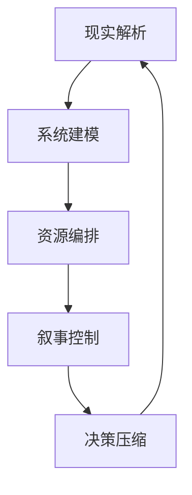

# 五大引擎详解

## 目录
1. 概述
2. 引擎1：现实解析引擎
3. 引擎2：系统建模引擎
4. 引擎3：资源编排引擎
5. 引擎4：叙事控制引擎
6. 引擎5：决策压缩引擎
7. 五大引擎闭环
8. 引擎应用场景

## 概述
顶级CEO的大脑可以拆成五个核心引擎，每个引擎都是一个可构建的系统模块。真正的顶级CEO不是五个能力，而是五个引擎形成一个自增强闭环。

## 引擎1：现实解析引擎（Reality Engine）

### 本质能力
看穿一切表象 → 识别真正的价值流。

### 输入
- 市场信息
- 用户行为
- 行业动态

### 输出
- 核心矛盾
- 需求缺口
- 可打穿点

### 能力价值
这是"看局能力"。顶级CEO看到的不是产品、用户、市场，而是"需求能量流 + 资源分布 + 结构缺口"。

### 典型例子
- 普通人看：电商 = 卖货
- 顶级CEO看：信息流 → 信任 → 转化 → 履约 → 复购 → 数据闭环

## 引擎2：系统建模引擎（System Engine）

### 本质能力
把机会变成"闭环结构"。

### 输出的不是方案，而是
- 流量结构
- 转化结构
- 收益结构
- 复利结构

### 核心判断
这个东西能不能形成飞轮？每个模块之间是否形成自增强循环？

### 能力价值
这是"建模能力"。把世界拆成可以控制的模块，然后让模块之间形成自增强循环。

### 五大核心模块
- 流量获取系统
- 转化系统
- 供给系统
- 履约系统
- 反馈系统

## 引擎3：资源编排引擎（Resource Engine）

### 本质能力
把"外部资源"变成"自己系统的一部分"。

### 操作方式
- 资本嵌入
- 人才绑定
- 供应链整合
- 渠道占领

### 核心原则
不拥有，但可调用。

### 能力价值
这是"资源编排能力"。不是拥有多少资源，而是如何组合和调度资源。

### 资源类型
- 人（组织）
- 钱（资本）
- 信息（数据）
- 信任（品牌）
- 权力（规则接口）

## 引擎4：叙事控制引擎（Narrative Engine）

### 本质能力
控制"别人如何理解现实"。

### 这不是营销，而是
- 改写认知
- 定义趋势
- 绑定信念

### 输出
- 投资人相信
- 用户相信
- 员工相信

### 能力价值
这是"现实控制器"。叙事 = 现实操作系统。先让人相信，再让事情发生。

### 关键认知
谁控制"别人相信什么"，谁就控制现实。

## 引擎5：决策压缩引擎（Decision Engine）

### 本质能力
在极复杂系统中快速做出最优路径选择。

### 核心机制
- 模型优先（不是感觉）
- 概率优先（不是确定性）
- 结构优先（不是事件）

### 特征
在极短时间内做出高质量决策。原因不是快，而是已经有成熟的判断模型。

### 能力价值
这是"决策效率"。顶级CEO不是"做对每一件事"，而是"让整体胜率为正，并放大胜利"。

### 决策模型
- 小错可以接受
- 大方向不能错
- 用结构对冲风险

## 五大引擎闭环

### 闭环的威力
1. 看得更准：比别人更早看到机会
2. 做得更对：把机会变成结构
3. 放得更大：用外力加速
4. 拉更多人进来：放大势能
5. 决策更快：抢占时间窗口
然后再强化"看局能力"

### 协同效应
- 现实解析为系统建模提供输入
- 系统建模为资源编排提供结构
- 资源编排为叙事控制提供势能
- 叙事控制为决策压缩提供信息优势
- 决策压缩强化现实解析能力

## 引擎应用场景

### 场景一：新业务探索
1. 现实解析：识别市场机会和价值缺口
2. 系统建模：设计商业模式和闭环
3. 资源编排：配置初始资源
4. 叙事控制：对内对外讲故事
5. 决策压缩：快速迭代和调整

### 场景二：组织扩张
1. 现实解析：理解组织现状和瓶颈
2. 系统建模：设计组织架构和流程
3. 资源编排：调动人才和资金
4. 叙事控制：统一愿景和文化
5. 决策压缩：快速决策推进

### 场景三：危机应对
1. 现实解析：识别危机本质和影响
2. 系统建模：设计应对方案
3. 资源编排：集中资源解决问题
4. 叙事控制：稳定信心和预期
5. 决策压缩：快速决策止损

### 场景四：战略升级
1. 现实解析：洞察行业趋势
2. 系统建模：重构商业模式
3. 资源编排：重新配置资源
4. 叙事控制：定义新叙事
5. 决策压缩：快速切换赛道

## 关键认知

### 从"人"到"系统"
顶级CEO不是五个能力，而是五个引擎形成闭环系统。这意味着：
- 能力从"人"解耦
- 决策从"感觉"变成"模型"
- 执行从"人力"变成"系统"

### 核心差异
- 普通人：拥有能力
- 顶级CEO：拥有系统能力

### 终极目标
构建一个"自动产生洞察、自动构建系统、自动优化决策"的系统。
