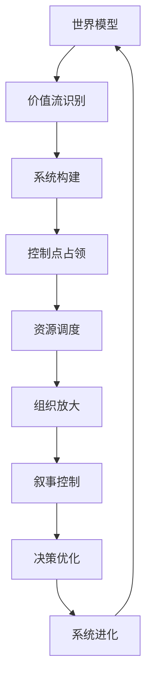

# 九层系统模型详解

## 目录
1. 概述
2. 世界模型层
3. 价值流层
4. 系统结构层
5. 控制点层
6. 资源网络层
7. 组织操作系统
8. 叙事系统层
9. 决策系统层
10. 进化系统层
11. 九层闭环
12. 应用要点

## 概述
九层系统模型是顶级CEO认知的核心框架，本质是"多层嵌套的现实控制系统"。这个系统干一件事：识别→定义→控制→放大→垄断"价值流动"。

## 第一层：世界模型层（World Model）

### 核心认知
- 世界 = 能量流动系统
- 人 = 需求载体
- 商业 = 需求交换结构
- 组织 = 放大器
- 资本 = 加速器
- 时间 = 复利引擎

### 顶级CEO看到的世界
不是"行业"，而是"需求能量在不同结构中的流动方式"。

### 认知差异
- 普通人：在规则内做选择
- 顶级CEO：在规则之上设计选择空间

## 第二层：价值流层（Value Flow）

### 核心结构
```
需求 → 注意力 → 信任 → 转化 → 交付 → 复购 → 裂变 → 数据 → 再优化
```

### 关键问题
- 价值从哪里来？
- 流向哪里？
- 卡在哪？

### 顶级CEO核心动作
找到"阻塞点" → 打穿 → 控制

## 第三层：系统结构层（System Architecture）

### 五大模块（不可缺）
1. 流量系统（入口）
2. 转化系统（变现）
3. 供给系统（产品/服务）
4. 履约系统（交付）
5. 反馈系统（数据）

### 核心要求
必须形成闭环，而不是单点能力。让每个模块之间形成自增强循环（飞轮）。

### 判断标准
- 能不能形成飞轮？
- 能不能越做越强？

## 第四层：控制点层（Control Points）

### 四大核心控制点
1. **入口控制（流量）**：谁控制用户入口，谁控制市场
2. **规则控制（标准）**：谁定义规则，谁收税
3. **供给控制（资源）**：谁掌握核心供给，谁有定价权
4. **数据控制（认知）**：谁拥有数据，谁拥有未来

### 权力法则
- 控制一个点 = 赚钱
- 控制多个点 = 定义行业

## 第五层：资源网络层（Resource Network）

### 资源类型
- 人才网络
- 资本网络
- 渠道网络
- 政策接口
- 信息网络

### 核心能力
低成本调用高价值资源。不是"拥有资源"，而是"构建一个资源可调度网络"。

### 关键原则
不拥有，但可调用。

## 第六层：组织操作系统（Org OS）

### 顶级组织的本质
让系统自动运转，而不是人推动。

### 核心结构
- 权责清晰（减少内耗）
- 信息透明（减少损耗）
- 激励绑定（驱动行动）
- 去中心化执行（提高效率）

### 核心原则
人只是节点，系统才是主体。

## 第七层：叙事系统层（Narrative System）

### 本质
控制"别人脑中的世界模型"。

### 作用
- 让资本相信
- 让用户相信
- 让员工相信
- 让市场相信

### 顶级操作
先定义意义，再收割现实。谁控制"别人相信什么"，谁就控制现实。

## 第八层：决策系统层（Decision System）

### 决策方式
不是靠经验、靠感觉，而是基于模型的概率决策系统。

### 核心机制
- 多路径模拟
- 风险对冲
- 动态调整

### 核心原则
不是做对，而是"整体胜率最大化"。

## 第九层：进化系统层（Evolution System）

### 核心能力
系统可以自我优化、自我升级。

### 机制
- 数据反馈
- 模型修正
- 结构升级
- 战略迭代

### 最终状态
系统越来越强，而不是人越来越累。这是"顶级CEO vs 普通CEO"的分水岭。

## 九层闭环



### 闭环的恐怖之处
1. 看得更准（Reality）：比别人更早看到机会
2. 做得更对（System）：把机会变成结构
3. 放得更大（Resource）：用外力加速
4. 拉更多人进来（Narrative）：放大势能
5. 决策更快（Decision）：抢占时间窗口
然后再强化"看局能力"

## 应用要点

### 核心差异
- 普通人：在已有系统中找位置
- 顶级CEO：在构建系统，让别人进入他的位置体系

### 关键认知
顶级CEO真正控制的不是公司、员工、产品，而是"不确定性"：
1. 消灭不确定性：用数据、用结构、用模型
2. 转移不确定性：转给市场、竞争对手、用户
3. 利用不确定性：在别人看不懂时下注

### 终极公式
顶级CEO = 世界模型 × 系统能力 × 控制力 × 进化能力
